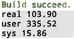
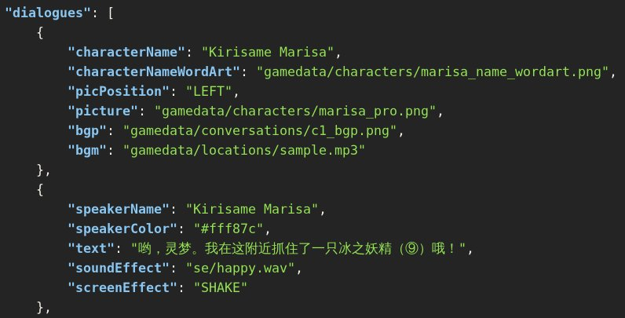
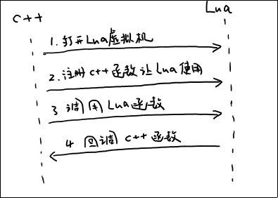
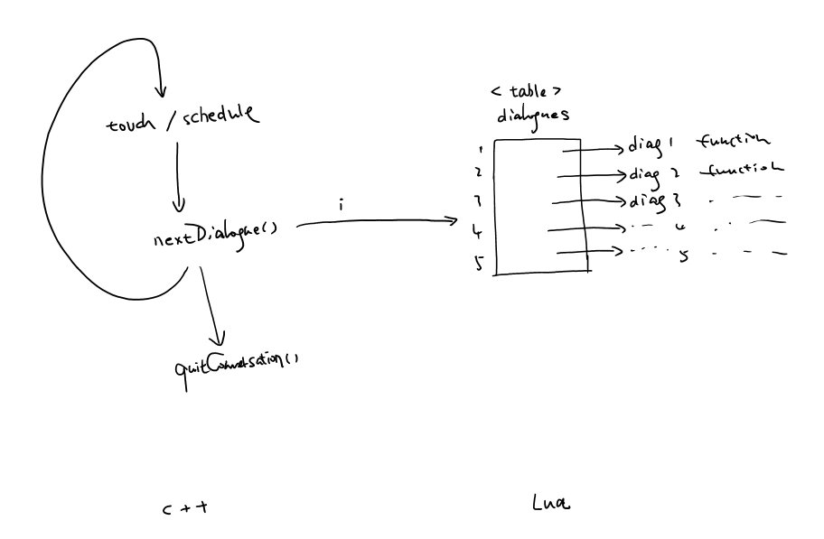
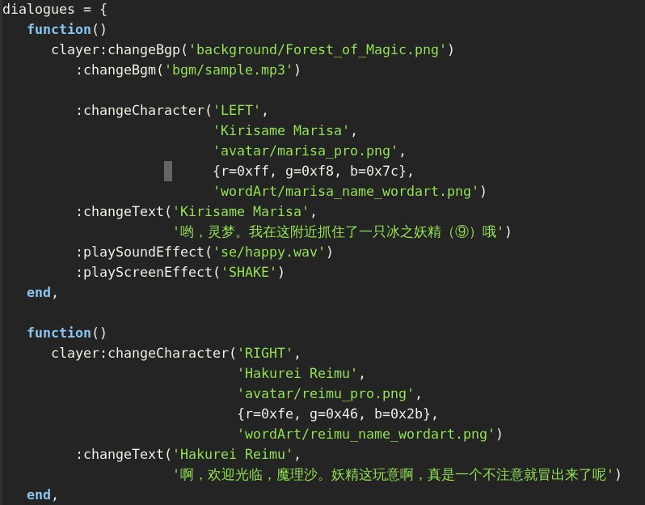

# Lua 集成与项目改造

<!-- TOC depthFrom:2 -->

- [1. 为了更快的迭代开发](#1-为了更快的迭代开发)
- [2. 已有的 JSON 设定/配置文件表达控制的能力不足](#2-已有的-json-设定配置文件表达控制的能力不足)
- [3. 需要引入 Lua](#3-需要引入-lua)
- [4. 但 cocos2d-x 只有 **做给他们自己用的** 一些工具](#4-但-cocos2d-x-只有-做给他们自己用的-一些工具)
- [5. 所以](#5-所以)
- [6. 配置 Android、Linux、Windows 三平台的构建系统](#6-配置-androidlinuxwindows-三平台的构建系统)
    - [6.1. Linux /CMakeLists.txt](#61-linux-cmakeliststxt)
    - [6.2. Android /proj.android/jni/Android.mk](#62-android-projandroidjniandroidmk)
    - [6.3. Windows /proj.win32/<proj>.{sln,vcxproj}](#63-windows-projwin32projslnvcxproj)
- [7. 从 C++ 代码生成 Lua 绑定](#7-从-c-代码生成-lua-绑定)
- [8. 改造 ConversationLayer](#8-改造-conversationlayer)
- [9. 改造后同组成员要做的事情](#9-改造后同组成员要做的事情)
    - [9.1. 使本地项目能构建起来](#91-使本地项目能构建起来)
    - [9.2. 如何使用 Lua 改造其他模块](#92-如何使用-lua-改造其他模块)

<!-- /TOC -->

## 1. 为了更快的迭代开发

现在我们的项目有将近两万行 C++ 代码，尽管我们已经做了各种减少模块间编译依赖的措施，在 Intel i7-7700k @4.2GHz 处理器上编译整个项目（不包括 cocos2d-x 引擎的编译）仍需要 **1 分 40 秒**：



慢速的项目编译构建速度严重影响了项目的迭代速度，我们需要一种不重新构建项目即可更改项目内各种逻辑的方法。

## 2. 已有的 JSON 设定/配置文件表达控制的能力不足

我们尝试使用了 JSON。但最初引入 JSON 是为了解决存档问题，因为 JSON 天生的树形结构很适合复杂数据的表达，但 JSON 在游戏逻辑表达方面有所欠缺。以对话为例，为了表现两个对话，我们需要写如下的 JSON 表达：



为了使数据访问层与游戏逻辑相隔离，我们不能再进一步设计更复杂的 JSON 表达形式，那样会使得游戏逻辑不得不处理 JSON 解析与反序列化相关的工作（更直接的说，游戏逻辑注册解析函数到数据访问层中）。

这种间接性给调试和更改工作带来了麻烦。

## 3. 需要引入 Lua

我们需要表达能力更强的 **嵌入式编程语言** 来解决这个问题。Lua 是我们经过综合考虑之后的选择。Lua 与 C/C++ 的亲和力很强，混合编程较为容易。因为 Lua 从一开始就是作为 C 语言项目的嵌入脚本来设计的。

以 C++ 为项目骨架，嵌入 Lua 的大概工作机制如下：



在整个过程中，我们需要关注：

- 第 2 步，注册 C++ 函数 --- 从 C++ 代码生成 Lua 绑定，再将其注册到 Lua 中
- 第 4 步，回调 C++ 函数 --- 正确编写 Lua 代码回调 C++

## 4. 但 cocos2d-x 只有 **做给他们自己用的** 一些工具

cocos2d-x 提供纯 C++ 项目和纯 Lua 项目的直接支持，但并没有 C++/Lua 混合项目的直接支持。为了支持纯 Lua 项目，cocos2d-x 有以下工具：

1. 从 C++ 生成 Lua 绑定的工具

    在 `cocos2d-x-3.14.1/tools/` 下有两个目录 `bindings-generator, tolua`。这是 cocos2d-x 团队做给他们自己用的从 cocos2d-x 引擎源源代码生成 Lua 绑定的工具。

1. 与 Lua 交互的 C++ 工具类

    在 `cocos2d-x-3.14.1/cocos/scripting/lua-bindings/manual` 目录下，有 `LuaEngine, LuaStack, LuaValue` 等工具类，还有 `tolua_fix.{h,cpp}` 一些用来辅助 Lua 对 C++ 对象生存周期管理的函数。

## 5. 所以

我们需要改造 cocos2d-x 自带的各种设施从

1. 项目构建
1. 生成/注册 Lua 绑定
1. 调用 Lua 代码

三方面来完成我们的 Lua 集成与项目改造任务。

## 6. 配置 Android、Linux、Windows 三平台的构建系统

在 cocos2d-x 生成的 C++ 项目中，并不包含 Lua 支持。需要添加 Lua 支持，我们需要构建子项目： `cocos2d-x-3.14.1/cocos/scripting/lua-bindings`。cocos2d-x 团队已经在其内放置了 CMake（Linux），NDK（Android），VS（Windows）等平台的构建规则，我们需要在我们的项目中引用这个项目。

### 6.1. Linux /CMakeLists.txt

1. Lua 子模块构建
   cocos2d-x-3.14.1 中 Lua 子模块构建由变量 `BUILD_LUA_LIBS` 控制（cocos2d-x-3.14.1 已经写好的），我们需要用 `CACHE` 覆盖所有子项目中的 `BUILD_LUA_LIBS` 变量，在 /CMakeLists.txt 中进行如下更改：

    ```
    @@ -37,7 +37,8 @@ include(CocosBuildHelpers)
      # libcocos2d
      set(BUILD_CPP_EMPTY_TEST OFF CACHE BOOL "turn off build cpp-empty-test")
      set(BUILD_CPP_TESTS OFF CACHE BOOL "turn off build cpp-tests")
    - set(BUILD_LUA_LIBS OFF CACHE BOOL "turn off build lua related targets")
    + set(BUILD_LUA_LIBS ON CACHE BOOL "turn on build lua related targets")
    + set(BUILD_LUA_TESTS OFF CACHE BOOL "turn off build lua-tests")
      set(BUILD_JS_LIBS OFF CACHE BOOL "turn off build js related targets")
      add_subdirectory(${COCOS2D_ROOT})

    ```

1. 编译时头文件搜索路径
    CMakeLists 中头文件搜索路径由 `include_directories` 控制，更改 `include_directory`：

    ```
    @@ -120,6 +121,10 @@ include_directories(
       ${COCOS2D_ROOT}/cocos/audio/include/
       ${COCOS2D_ROOT}/extensions
       ${COCOS2D_ROOT}
    +  ${COCOS2D_ROOT}/cocos/scripting/lua-bindings/manual
    +  ${COCOS2D_ROOT}/external/lua/lua
    +  ${COCOS2D_ROOT}/external/
    +  ${COCOS2D_ROOT}/external/lua/tolua
       Classes
     )
     if ( WIN32 )
    ```

1. 链接参数
    CMakeLists 中链接参数由 `target_link_library` 控制，更改 `target_link_library` 如下：

    ```
    - target_link_libraries(${APP_NAME} cocos2d)
    + target_link_libraries(${APP_NAME} luacocos2d)
    ```

### 6.2. Android /proj.android/jni/Android.mk

Android NDK 使用的 `Android.mk` 机制与 CMake `CMakeLists` 类似。而 Android 中的 module 更推荐使用 `LOCAL_EXPORT_C_INCLUDES` 来影响父模块的头文件搜索路径（cocos2d-x-3.14.1/cocos/scripting/lua-bindings/proj.android 也确实这么做了）。

所以，在 Android 中，我们只需要关心：

1. Lua 子项目构建
    Android NDK `import-module` 命令用来构建子模块。在 /proj.android/jni/Android.mk 中我们进行如下更改：

    ```
    @@ -64,2 +64,3

    + $(call import-module,scripting/lua-bindings/proj.android)
      $(call import-module,.)
    ```

1. 链接参数

    Android NDK 中，本模块所依赖的库由 `LOCAL_STATIC_LIBRARIES` 指定，我们进行如下更改：

    ```
    @@ -55,6 +55,7 @@ LOCAL_C_INCLUDES := $(LOCAL_PATH)/../../Classes


      LOCAL_STATIC_LIBRARIES := cocos2dx_static
    + LOCAL_STATIC_LIBRARIES += cocos2d_lua_static

     # _COCOS_LIB_ANDROID_BEGIN
     # _COCOS_LIB_ANDROID_END
    ```

### 6.3. Windows /proj.win32/<proj>.{sln,vcxproj}

1. Lua 子项目的构建

    在 proj.win32/<proj>.sln 中添加子项目：
    
    ```
    Project("{8BC9CEB8-8B4A-11D0-8D11-00A0C91BC942}") = "libluacocos2d", "..\cocos2d\cocos\scripting\lua-bindings\proj.win32\libluacocos2d.vcxproj", "{9F2D6CE6-C893-4400-B50C-6DB70CC2562F}"
    +EndProject
    ```

1. 编译时头文件搜索路径

    更改 /proj.win32/<proj>.vcxproj 中 `AdditionalIncludeDirectories`
    
    ```
    <AdditionalIncludeDirectories>$(EngineRoot);$(EngineRoot)external;$(EngineRoot)external\lua\lua;$(EngineRoot)external\lua\tolua;$(EngineRoot)cocos\audio\include;$(EngineRoot)external\chipmunk\include\chipmunk;$(EngineRoot)extensions;..\Classes
   ```

1. 链接参数

    更改 /proj.win32/<proj>.vcxproj 中 `PreprocessorDefinitions`
    
    ```
    <PreprocessorDefinitions>WIN32;_DEBUG;_WINDOWS;_USE_MATH_DEFINES;GL_GLEXT_PROTOTYPES;CC_ENABLE_CHIPMUNK_INTEGRATION=1;COCOS2D_DEBUG=1;_CRT_SECURE_NO_WARNINGS;_USRLUASTATIC;_SCL_SECURE_NO_WARNINGS;%(PreprocessorDefinitions)</PreprocessorDefinitions>
    ```

## 7. 从 C++ 代码生成 Lua 绑定

Lua 绑定说到底是一些供 Lua 调用的 C 代码。由于 Lua 函数调用规则与 C 调用规则（calling convention）不同，这些 Lua 绑定做从解析调用函数，再调用 C 代码的工作。

`cocos2d-x-3.14.1/tools/tolua` 的工作过程如下：

1. libclang 解析 C/C++ 代码
1. genbindings.py (python 代码) 抽取解析结果，根据
    1. 生成模板（tools/bindings-generator/targets/lua/templates）
    1. 用户自定义的生成规则（tools/tolua/<module>.ini）
生成相应的 Lua 绑定（C 代码） 到 `cocos2d-x-3.14.1/cocos/scripting/lua-bindings/auto`

要从我们自己写的 C++ 代码生成 Lua 绑定，我们需要：

1. 配置 `tools/tolua` 的工作环境
    `tolua` 及其依赖的 `bindings-generator` 需要 `ndk-r9b` 的工作环境。`bindings-generator` README 明确指出
    > only the NDK r9b is can work corrently with it.
1. 自定义生成规则 `tools/tolua/<module>.ini`。具体规则参考原目录下的各 ini 文件
1. 修改 `tools/tolua/genbindings.py`，使其使用我们自定义的规则
1. 指定 Lua 绑定的输出目录为 `<proj>/Classes/LuaBindings`
1. 将生成的 Lua 绑定文件 `{h,cpp}` 加入各平台编译系统
1. 修改 `AppDelegate.cpp` 使应用启动时注册 Lua 绑定到 Lua 运行时中

具体的修改内容参考 commit `97a0e49, 90b2b43,f87a8e5, b5b5bef`。

## 8. 改造 ConversationLayer

`ConversationLayer` 是项目改造的第一试验点。根据 `ConversationLayer` 的工作原理，我们决定使用以下 C++Lua 协同工作机制：



`touch/schedule/nextDialogue/quitConversation` 框架仍然在 C++ 端，但具体的对话在 Lua 端一个 `table` 内存放。当要执行具体的第 `i` 条对话时，C++ 调用 Lua 端相应代码，并将 `i` 传递给 Lua，Lua 端函数根据这个 i 调用对应对话。

1. C++ 端执行常规的 Lua 栈操作来与 Lua 交互
1. Lua 端以如下方式编写 table[i]：

    

## 9. 改造后同组成员要做的事情

### 9.1. 使本地项目能构建起来

1. 将 `cocos2d-x-3.14.1/cocos/scripting` 拷贝到 `<proj>/cocos2d/cocos/` 下
1. 将 `cocos2d-x-3.14.1/external/lua/` 拷贝到 `<proj>/cocos2d/external` 下

### 9.2. 如何使用 Lua 改造其他模块

1. 下载 `tolua` 的工作环境 ndk-r9b，将其放入 AndroidDev 目录（AndroidDev 相关内容参考 *cocos2d-x 安装配置使用指南*）下，命名为 `ndk-r9b`
1. 在 `<proj>/tools/tolua` 下编写对应 `<module>.ini` 生成规则
1. 将上一步编写的 `<module>.ini` 加入 `proj>/tools/tolua/genbindings.py` 中，后运行以生成 Lua 绑定
1. 将 Lua 绑定 {h,cpp} 加入 Android，Linux，Windows 三平台的构建系统中
1. 修改 `<proj>/Classes/AppDelegate.cpp`，注册 Lua 绑定到 Lua 运行时中
1. 设计 C++/Lua 协同工作机制，修改 C++ 对应模块，编写 Lua 对应代码
