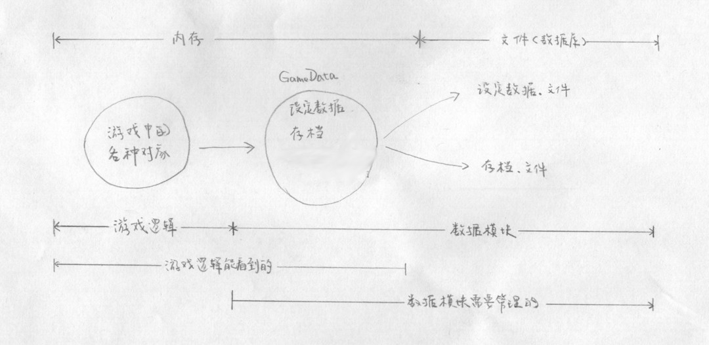
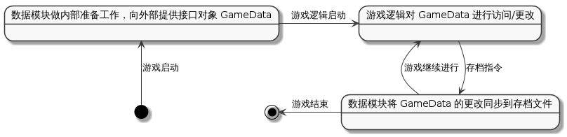
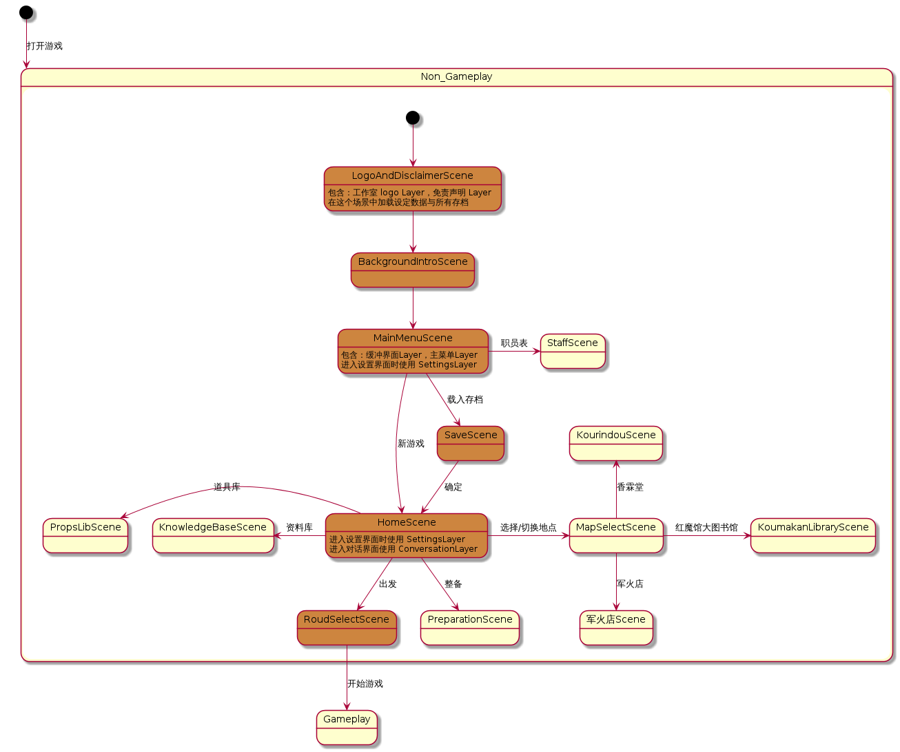
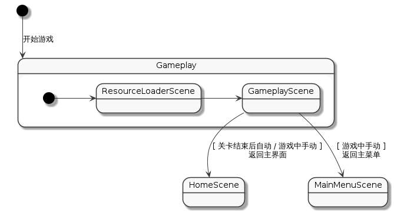
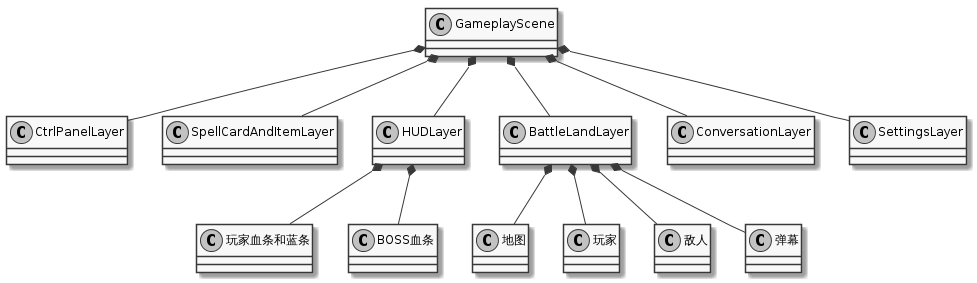
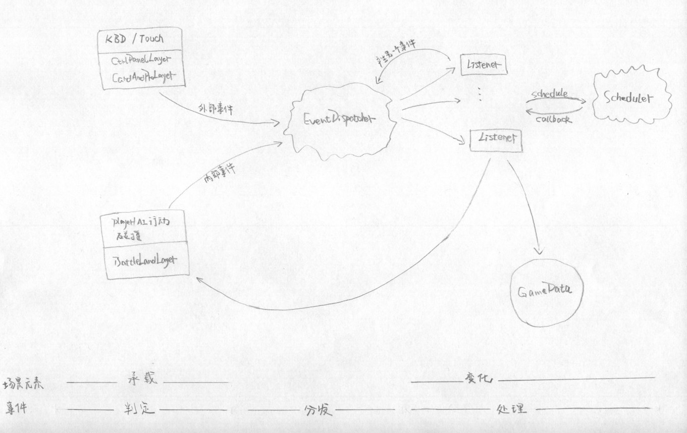
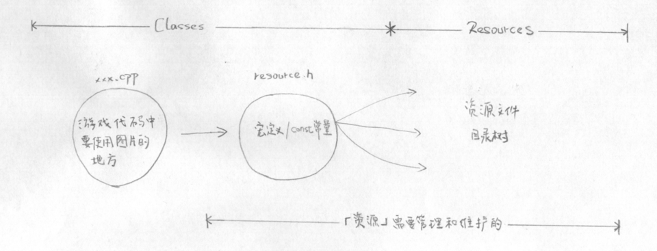
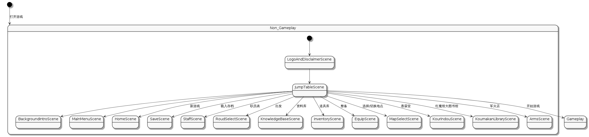

# 总体实现方案

注意：本文档中所提到的 `场景`，均指实现上的概念，对应实际的 `cocos2d::Scene`；『概念设计图』的一个个方框在本文档中称为 `界面`。多个 `界面` 可能被放置到一个 `场景` 中实现。

---

<!-- TOC depthFrom:2 -->

- [1. Android 版本与分辨率适配](#1-android-版本与分辨率适配)
    - [1.1. 版本适配](#11-版本适配)
    - [1.2. 物理分辨率适配](#12-物理分辨率适配)
- [2. 数据模块](#2-数据模块)
    - [2.1. 数据分类](#21-数据分类)
    - [2.2. 数据模块接口对象 GameData](#22-数据模块接口对象-gamedata)
    - [2.3. GameData 对应特定存档](#23-gamedata-对应特定存档)
    - [2.4. 使用注意](#24-使用注意)
- [3. 从数据角度看游戏过程](#3-从数据角度看游戏过程)
- [4. 场景划分](#4-场景划分)
- [5. Non-Gameplay 场景](#5-non-gameplay-场景)
    - [5.1. 一些特殊 Scene/Layer 的说明](#51-一些特殊-scenelayer-的说明)
        - [5.1.1. SaveScene](#511-savescene)
        - [5.1.2. MainMenuScene 和 HomeScene 的 SettingsLayer](#512-mainmenuscene-和-homescene-的-settingslayer)
        - [5.1.3. 很多场景都用到的 ConversationLayer](#513-很多场景都用到的-conversationlayer)
    - [5.2. 场景切换与生存周期](#52-场景切换与生存周期)
        - [5.2.1. 从哪进入就返回到哪](#521-从哪进入就返回到哪)
        - [5.2.2. 要怎么实现长生存周期？](#522-要怎么实现长生存周期)
        - [5.2.3. 由长生存周期而带来的问题及其解决方案](#523-由长生存周期而带来的问题及其解决方案)
- [6. Gameplay 场景](#6-gameplay-场景)
    - [6.1. ResourcesLoaderScene](#61-resourcesloaderscene)
    - [6.2. GameplayScene](#62-gameplayscene)
        - [6.2.4. 一切都纳入事件机制](#624-一切都纳入事件机制)
        - [6.2.5. 使用物理引擎进行碰撞判定与处理](#625-使用物理引擎进行碰撞判定与处理)
        - [6.2.6. 地图与敌人](#626-地图与敌人)
        - [6.2.7. 弹幕](#627-弹幕)
        - [6.2.8. BOSS](#628-boss)
- [7. 资源的使用](#7-资源的使用)
    - [7.1. resources.h](#71-resourcesh)
- [8. 开发脚手架](#8-开发脚手架)
    - [8.1. Non-Gameplay 场景的跳转表](#81-non-gameplay-场景的跳转表)
    - [8.2. Gameplay 场景的 MockListener](#82-gameplay-场景的-mocklistener)
    - [8.3. resources.h.dir](#83-resourceshdir)
    - [8.4. 内有文字的矩形/圆 PlaceHolder](#84-内有文字的矩形圆-placeholder)

<!-- /TOC -->

---

## 1. Android 版本与分辨率适配

### 1.1. 版本适配

| | |
| --- | --- |
| SDK 最低版本 | API 19（Android 4.4） |
| SDK 目标版本 | API 23（Android 6.0） |
| SDK 编译版本 | API 23（Adnroid 6.0） |

版本会在 `AndroidManifest.xml`（还有其他地方？） 中直接指定，编程时无需显式指定也无需担心。

### 1.2. 物理分辨率适配

| | |
| --- | --- |
| 设计分辨率 | 1280x720 |
| 缩放策略 | FIXED_HEIGHT |
| 适配的物理分辨率范围 | [720p, 2k] |
| 主要适配的物理分辨率 | 1080p，720p |

在编程时要先用 `auto visibleSize = Director::getInstace()->getVisibleSize()` 得到 visibleSize, 然后根据这个 visibleSize 对界面元素进行**相对布局**。（为了效率考虑，可以在类内部缓存得到 visibleSize。）

欲在屏幕右上角放置一个元素，

正确示例：

```
node.setPosition(Vec2(visibleSize.width - 100, visibleSize.height - 100));
```

错误示例：

```
node.setPosition(Vec2(1180,620));
```

## 2. 数据模块

### 2.1. 数据分类

在实际讨论数据处理之前，我们先对游戏中要用到的非实现相关的数据分一下类：

| 类别 | 运行时是否改变 | 包含的数据 |
| --- | --- | --- |
| 设定数据 | 否 | 对话，道具效果等这些设定 |
| 存档 | 是 | 各个相互独立，且可自由切换的存档 |
| 运行时不需要在场景间共享的数据 | 是 | 场景自己的 |

### 2.2. 数据模块接口对象 GameData

为方便管理存档数据和设定数据，我们将数据从游戏逻辑中抽取出来，做成一个独立的数据模块。这个数据模块向游戏逻辑隐藏存档与设定数据的具体存储细节，并提供接口对象 GameData（singleton）供游戏逻辑使用。

GameData 中总共有两种类型的数据：设定数据，存档。但对游戏逻辑来说，它不需要分清 GameData 里面哪些是设定数据，哪些是存档；GameData 对象里面的就仅仅是数据而已，需要什么就读取什么，想改什么就改什么。



### 2.3. GameData 对应特定存档

GameData 在同一时间对应且仅对应一个存档。外部逻辑访问 GameData 时不需要显式地给出存档编号，所有的操作都默认作用在一个特定的存档上。当需要操作另一个存档时，需要使用 `GameData->getInstance()->switchSave(saveTag)` 将 GameData 对应的存档换掉，自此以后所有的操作都会默认作用到 `saveTag` 存档上。

由于只有固定个数的存档，`saveTag` 为 int 格式，1 就表示 1 号存档，2 就标示 2 号存档，以此类推。

### 2.4. 使用注意

1. **不要缓存从 GameData 得到的数据**。

    1. 原因一：可能会失效。可能会每一次对 GameData 对象的访问（接口调用）都可能使『上一次 GameData 访问所得到的数据』失效。
    1. 原因二：没有必要。为了效率考虑，GameData 会将数据与存档文件全部读入内存中，对于计算量较大的数据也可能会内部缓存。访问 GameData 时并没有明显的效率损失。

## 3. 从数据角度看游戏过程



## 4. 场景划分

我们将游戏中的所有场景大致分为两类：

- Non-Gameplay 场景。指道具库，主界面，设置，存档界面等那些『非玩家操作人物实际冒险』的场景。
- Gameplay 场景。指『玩家操作人物实际冒险』的场景。


这么分类的原因主要是：

- 这两类场景实现方式明显不同，运行机制明显不同。一个是简单的 MenuLayer，一个是地形，敌人，弹幕，物理引擎，用户操作等组件之间的事件检测、分发、处理。
- 不同类的场景之间相互切换时有不同的方案。当然了，这是为了性能而必需付出的代价。

场景具体划分方案、实现方案、场景间切换方案见后续章节。

## 5. Non-Gameplay 场景

场景自上而下进行，深颜色表示的是关键路径，浅颜色表示的是可选路径（图）。

注意：『概念设计图』中的多个界面（设计上的概念）可能仅对应下图中一个场景（实现上的概念），一个场景若包含了多个界面，会在图中说明。



### 5.1. 一些特殊 Scene/Layer 的说明

本节会深入一些特殊的 Non-Gameplay 场景内部。

注：没有在本节提到的 Non-Gameplay 场景一般逻辑都非常简单，大多数都只是『Menu + 一些回调函数』，实现时自行按照『概念演示图』所示界面做即可。

#### 5.1.1. SaveScene

可以从两个地方进入 `SaveScene`，两种地方进入 `SaveScene` 它所要执行的动作不同：

1. 从 `MainMenuScene` 进入，做『读取存档』动作
1. 从各场景的 `SettingsLayer` 进入，做『保存存档』动作

为实现这一点：

1. 在创建 `SaveScene` 时，即指定是执行『读取』还是『保存』动作： `SaveScene::create(boolean isSaveAction)`。

#### 5.1.2. MainMenuScene 和 HomeScene 的 SettingsLayer

从不同场景进入设置界面时，设置界面有不同的可设置项。为实现这一点：

1. 给每个 Scene/Layer 增加数据成员 `static const std::string TAG = "SceneName/LayerName"`，用来标识 Scene/Layer 自己。
1. 在创建 SettingsLayer 时即指定创建者 `SettingsLayer::create(const std::string& sceneTag)`。SettingsLayer 内部可以根据这个传入的 sceneTag 来决定自己行为。

#### 5.1.3. 很多场景都用到的 ConversationLayer

很多场景中都可能使用对话。而且根据游戏进度，对话可能发生也可能不发生（由各场景自己处理）。为了更灵活的使用，我们将对话做成 Layer: ConversationLayer。

ConversationLayer 可能会在一个场景中多次使用，所以不在创建时指定所有信息。而使用特定的接口，传递特定的参数来设置对话背景/对话人物/对话内容。

### 5.2. 场景切换与生存周期

Non-Gameplay 场景的生存周期拟定为 [第一次创建此场景, 进入 Gameplay 场景)。

我们靠控制场景切换时的行为来控制场景的生存周期：

| 场景切换双方 | 是否保留被替换掉的场景 | 为什么 |
| --- | --- | --- |
| Non-Gameplay -> Non-Gameplay | 是 | 用户第二次进入此场景时，可以加快速度 |
| Non-Gameplay -> Gameplay | 否，而且删除所有 Non-Gameplay 场景缓存 | 为 Gameplay 场景让出内存 |
| Gameplay -> Non-Gameplay | N/A | 待后续章节介绍|

#### 5.2.1. 从哪进入就返回到哪

『概念设计图』中提到，从哪个场景进入就返回哪个场景。为实现这个特性，我们需要保存场景间的切换先后关系 —— 使用 cocos2d::Director 维护的场景栈。

如果将 Non-Gameplay 场景中的所有场景及其间跳转关系看成一棵树，使用场景栈的规则是：

- 从父节点到子节点，压栈
- 从子节点返回父节点，退栈

#### 5.2.2. 要怎么实现长生存周期？

- 不使用场景栈：最简单的实现方案是使用 Director 维护的场景栈来保存被替换掉的场景。但我们并不能保证场景与场景之间的切换关系能形成有向无环图（尽管现在是）。

- 不做成 singleton：对 singleton 机制稍加改变，『给每个场景加上 `destorySelfIfexists()` 方法，在进入 Gameplay 场景时依次调用各场景的这个方法来销毁它们自己』这个方法听起来也不错。但这种没有作成缓存对象方便，尤其是在场景数量可能变化时。

- 使用自定义的缓存对象： 做一个缓存对象（singleton）：NonGameplayScenesCache，其内维护一个 Map\<std::string, Scene*\>，不用的场景保存进去，用的场景再读出来。

    1. 给每个 Scene 增加数据成员 `static std::string TAG = "SceneName"`，用来标识 Scene 自己。
    1. 自定义 Scene::create()：在 create 函数中以 TAG 作为键值查询 NonGameplayScenes 缓存查找自己，找到了则返回；否则：
        1. new 自己
        1. init 自己
        1. 将自己加入 nonGameplayScenes 缓存


**注**：模仿 `cocos2d::CREATE_FUNC`，我们在 `AppMacros.h` 中定义了一个宏 `APP_SCENE_CREATE_FUNC`。在实现场景时可以直接使用这个宏来展开能使用缓存的 `create()` 函数。

#### 5.2.3. 由长生存周期而带来的问题及其解决方案

1. 场景切换时，场景展示内容要变化
    如『概念设计图』所述，同一场景切换回来时可能会它的界面会变化（比如在 MapSelectScene 中更换了地图之后再返回 HomeScene，HomeScene 的背景图就要变化）。可以在 `Scene::onEnter()` 这个函数成员中处理这个变化，这样 cocos2d-x 引擎可以自动在切入这个场景时调用（像 Android 一样）。

## 6. Gameplay 场景

Gameplay 共有两个场景，一个 `ResourcesLoaderScene` 负责加载资源，一个 `GameplayScene` 负责运行游戏。



按照『概念设计图』所述，在 Gameplay 场景中有且仅有『返回主菜单』和『返回主界面』两种方式退出 Gameplay 场景，分别返回到 `MainMenuScene` 和 `HomeScene`。返回到 Non-Gameplay 场景之后的行为同 Non-Gameplay 对应章节介绍。

### 6.1. ResourcesLoaderScene

ResourcesLoaderScene 要完成以下任务：

1. 创建 `GameplayScene` 及其 UI 树
1. 初始化 `GameplayScene` 内数据
1. 加载所有 `GameplayScene` 要用到所有纹理资源/地图资源
1. 创建并注册所有 `GameplayScene` 运行时要使用的 Listener
1. 资源加载完成时进入 `GameplayScene` ，并销毁自己（利用 cocos2d-x 自带的内存管理机制）

为使 ResourcesLoaderScene 加载资源时界面不失去响应，可以使用多线程技术同时进行『资源加载』和『加载界面显示』。若由于某些原因，无法使用多线程简单的解决问题，可以做 workaround：将任务分割到不同的帧上，每一帧完成一部分任务。

### 6.2. GameplayScene

GameplayScene 的 UI 树组织如下：

// TODO 进一步完善



#### 6.2.4. 一切都纳入事件机制



使用事件机制后，我们的代码明显分成了四部分：

1. 场景承载（场景元素的组织与承载，UI 树）
1. 场景元素自行动（敌人的自动行走，攻击）
1. 事件判定（用户按下了前进键，打死了一个敌人，捡了一个物品 ...）
1. 事件处理（用户按下前进键要发生什么，打死一个敌人后要发生什么，捡了一个物品后要发生什么 ...）

其中由于 3 事件判定需要 1 场景层所承载元素的各种信息，为了方便，我们将它们写到一起。用户操纵和释放技能的做成 `CtrlPanelLayer`、`SpellCardAndItemLayer`，地图和敌人行动的做成 `BattleLandLayer`。

为了将各种事件的处理逻辑从代码层面上分离，方便不同的人同时工作，每类事件的 Listener 我们都做成一个从 `EventListenerCustom` 派生的类 `Listener*`。它提供 `static EventListenerCustom* createAndRegister(const std::string& eventName, Node* bindNode = nullptr) ` 方法来创建并注册自己。

相比于函数直接调用，事件分发机制明显比较复杂。但事件分发机制将一个事件的『判定过程』和『处理过程』进行了很好的分离。这个特性使得我们可以很容易地 a) 做测试 b) 不同人同时开发同一模块。（具体见『开发脚手架』一节）

#### 6.2.5. 使用物理引擎进行碰撞判定与处理

// TODO 碰撞判定表

// TODO 碰撞处理

#### 6.2.6. 地图与敌人

// TODO by 张晨

#### 6.2.7. 弹幕

// TODO by 朱宏伟

#### 6.2.8. BOSS

// TODO by 张晨

## 7. 资源的使用

Resources 文件夹下的所有东西统称为『资源』。这一节会说明如何在游戏代码中使用资源 --- 使用『资源』向游戏代码提供的隐藏掉其自身物理组织的接口: `resources.h`。

『资源』的物理组织，即『哪些文件应该放入哪些文件夹』，这些问题不在本节讨论范围。

### 7.1. resources.h

有两个原因，我们不使用像 `images/logo.png` 这样的实际路径：

1. 资源的物理组织方案尚未完成。现在还没有决定如何组织资源，哪些文件应该放入哪些文件夹，应该以怎样的层级组织资源。如果现在实现时就硬编码到程序里面了，以后资源的物理组织方案决定以后，还要更改游戏代码所有用到资源的地方。
1. 实际路径会使得游戏代码依赖于资源的实现。如果资源文件后来变更了位置，还要手动更改游戏代码中所有使用该资源文件的地方。

所有要使用资源的游戏模块都要 `include "resources.h"` 并使用其中定义的宏 / const 常量来访问资源。



resources.h 内容由『资源』管理和维护，由实现『资源』物理组织的人管理和维护。

## 8. 开发脚手架

至此，我们的『数据实现方案』、『场景实现方案』、『资源使用方案』都已经介绍完了。但这样是没办法直接动工的，各场景/模块之间有很强的依赖关系，若没有一些辅助性组件，我们只能等到一个模块开发完成之后才能去开发另一个模块。

### 8.1. Non-Gameplay 场景的跳转表

Non-Gameplay 场景之间的数据依赖通过引入 GameData 已经解决了。但控制流是自上而下的，不同人开发不同场景时势必要根据自己的场景重定向控制流以便于测试，而这种控制流的重定向在代码层面是很难合并到一起。

所以，在 `LogoAndDisclaimerScene` 下面（`LogoAndDisclaimerScene` 要负责数据模块的加载，我们不能跳过它）我们额外增加一个场景 `JumpTableScene`，统一地来做控制流重定向，只要在 `JumpTableScene` 里面点击相应的按钮就可以跳转到相应场景。



这样，就可以继续进行开发了。不过还有一个问题，其他场景没有完成的时候，跳转到其他场景的代码可能无法正常运行，甚至编译都无法通过。

所以，场景的内部实现时，跳转到其他场景的代码先写好并注释掉。等所有人都写完所有场景了，再进行合并，将控制流改回来。

### 8.2. Gameplay 场景的 MockListener

`MockListener` 是日志型的 Listener，由 `ResourcesLoaderScene` 负责创建和注册，用于辅助『判定』代码。它接收所有自定义类型的事件，每接收一个事件便向 Console 打一条 log。判定代码可以根据打的 log 来判断自己何时发出了事件，并根据这个发出时间调整自己的判定条件。

当真实的 Listener 写好之后，只需要将真实的 Listener 注册到 `EentDispatcher`，Listener 即可正常工作；『判定』代码和其他代码不需要做任何改动。

### 8.3. resources.h.dir

游戏最终完成之前，谁也不知道最终要用到多少资源（图片/音乐），资源文件以及 `resources.h` 需要在开发时动态变化。然而开发过程中若每个人都根据自己的需要去改动 `resources.h` 这一个文件，由于版本控制软件的限制，不同人的改动很可能会造成冲突。若处理不得当则可能会影响他人的工作。

所以，为了避免多人对同一个文件进行编辑：

1. 我们引入 `resources.h.dir`。每个场景在这个目录下都有一个对应的头文件（命名可以使用场景名的一部分，只要不与其他场景的头文件名一样就行），头文件中定义了这个场景要用到的所有资源，图片资源定义以 `IMG_XXX_` （XXX 为场景名或部分场景名）开头，声音资源定义以 `SND_XXX_` 开头
1. 在 `Resources` 目录下每个场景对应一个子目录，存放这个场景要用到的资源

比如：

LogoAndDisclaimerScene 用到的资源文件在 `Resources/logo` 中，资源定义头文件为 `resources.h.dir/logo.h`，其中图片定义以 `IMG_LOGO_` 开头，音乐定义以 `SND_LOGO_` 开头。

**最终合并**:

按照『资源的使用』一节所说，所有的资源定义最终要合并到一个头文件 `resources.h` 中，所有的资源最终会进行重组织。

如果我们以后真的需要进行合并工作，只需要：

1. 将 `resources.h.dir` 下所有头文件合并为一个头文件，并根据资源文件的物理组织改变每个定义的值
1. 将每个 cpp 文件包含的头文件由 `resources.h.dir/xxx.h` 改为 `resources.h`

### 8.4. 内有文字的矩形/圆 PlaceHolder

如果你喜欢快速原型，那么本节是为你准备的。

// TODO 示意图

矩形/圆内有文字，可设置背景颜色，文字颜色，矩形/圆大小。
