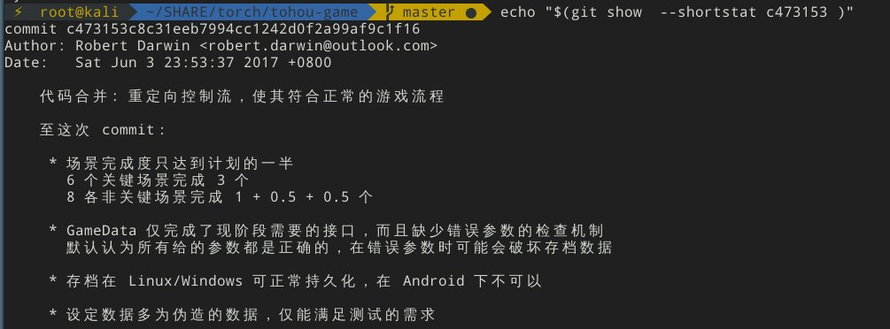
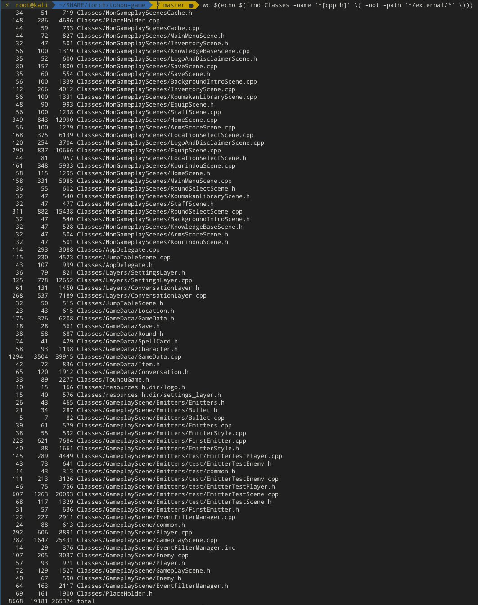

# 0720 进度，计划，工作情况

<!-- TOC depthFrom:2 -->

- [1. 进度，计划](#1-进度计划)
    - [1.1. 已经过去的第一阶段怎么样](#11-已经过去的第一阶段怎么样)
    - [1.2. 第二阶段进行的怎么样了](#12-第二阶段进行的怎么样了)
    - [1.3. 第三阶段有怎样的计划](#13-第三阶段有怎样的计划)
- [2. 工作情况](#2-工作情况)
    - [2.1. 暑假补全工作尚没有进展](#21-暑假补全工作尚没有进展)
    - [2.2. 有些人尚需努力](#22-有些人尚需努力)
- [3. 后话](#3-后话)
    - [3.1. 为什么第一阶段都在做 NonGameplayScenes](#31-为什么第一阶段都在做-nongameplayscenes)
    - [3.2. 为什么“我”没有参与到第二阶段中](#32-为什么我没有参与到第二阶段中)

<!-- /TOC -->
## 1. 进度，计划

### 1.1. 已经过去的第一阶段怎么样

已经过去的第一阶段，如『3.开发流程与计划/第一阶段开发计划』所说，是计划在中期验收以前，

1. 干完所有 NonGameplay 场景
1. 完成数据存储与解析
1. 并且试验 GameplayScene 实现方案

但到第一阶段结束时，现在也是，后两个目标近乎完成，第一个目标只完成了一半。



这个结果很不乐观。因为说实话第一阶段是一个启动阶段，主要是出工作流程，工作计划和协作方案的。编码在其中只占了很小一部分。

### 1.2. 第二阶段进行的怎么样了

第二阶段在『3.开发流程与计划/第二阶段开发计划』里面说的是一个主设计的阶段，主要设计 Gameplay 场景及其内各种元素。但从人员和时间两方面综合来考虑，在第二阶段设计与实现要同步进行，结构性和机制性的东西要完全实现，不然无法支持第三阶段的『填充』式工作。

现在是，

- 张晨来做的策划，Gameplay 场景流程控制，AI，地图
- 张健淳来做的基础性与机制性的设施（事件等），ConversationLayer
- 朱宏伟来做的弹幕系统

Gameplay 场景的具体结构与『总体实现方案』大致一致，不一致的地方会逐步更新。代码库一直在同步更新。

可以说是稳步进行。

### 1.3. 第三阶段有怎样的计划

没有明确的任务划分和明确的职责划分，就需要依靠不断不断不断的沟通来协调不同人的工作。两三人还好，对于我们一个十个人的项目组来说，沟通的成本是巨大的。

所以，当第二阶段的设计工作基本完成以后，对于项目中的各工作点，会做到 **统筹规划，职责明确，责任到人**。不会再出现像第二阶段这样的混乱不清，不知道自己要干什么，不知道别人在干什么。

## 2. 工作情况

### 2.1. 暑假补全工作尚没有进展

### 2.2. 有些人尚需努力

直白的说，以现在的工作情况来看，现在组里面有些人是过不了最终验收的。

如下图所示，到 `2017-02-20 22:52 UTC+0800`，算上代码中的空行，除去第三方库，我们已经提交了 8668 行代码了。



大致估计，我们的整个项目到最后可能会有两三万行代码。我们的工作进行在 Git 平台上，最终验收的时候不可避免地要使用 Git 提供的各种统计报告工具。如果最终验收的时候贴出来精确到人的统计报告，有的人只有两三百行代码或者根本没有代码，不知道验收老师会怎么想。

按我们的项目规模来看，最低限度，**每个人（包括各种职位）** 至少需要：

1. 理解项目结构，理解用于搭建总体结构的代码
1. 验收时有自己能拿出手的独立完成的成果面对老师提问
1. 独立编写并提交至少一两千行的代码

    在本地代码库根目录下使用 git bash 执行如下命令（整个复制，更改 author 参数）可以统计自己以往的代码行数：

    ```
    git log --author="you-git-name-here" --pretty=tformat: --numstat -- Classes \
    | gawk '{ ins += $1; del += $2; tot += $1 + $2 } END { printf "Insertion: %s\nDeletion: %s\nTotal: %s\n", ins, del, tot }' -
    ```

## 3. 后话

### 3.1. 为什么第一阶段都在做 NonGameplayScenes

『第一阶段』说实话是个项目开始阶段，是准备数据和试验关键技术的阶段。

在项目开始之前，组里面十个人没有一个人有具体的游戏开发经验和 cocos2d-x 使用经验。所以张晨和张健淳做好『总体实现方案』之后，张晨来做的 GameplayScene 实现方案的试验，张健淳来做的数据模块。各 NonGameplayScenes 是由大家来做的。

NonGameplay 场景的实现情况也计划作为后续各阶段项目规划和任务分配的依据。毕竟『Talk is cheap, show me the code』。

### 3.2. 为什么“我”没有参与到第二阶段中

大多的原因是：因为你第一阶段的工作都没有完成，也没有主动去参与第二阶段。

『3.开发流程与计划/第二阶段开发计划』中是这么说的：

> 为了尽量不影响诸位时间，也为了避免分工不均影响到个人的暑期安排，这次不单独分配任务至个人，而是选做，你选做了什么，在群里说一下就行了，同一个工作不限制人数，只要你们能够协调好。重要的不是形式，而是结果。

