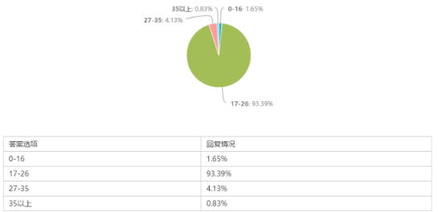
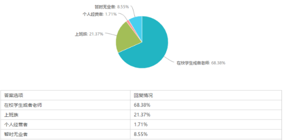
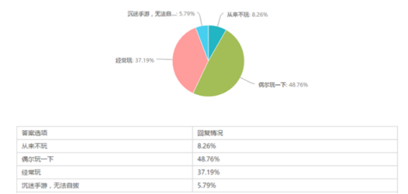
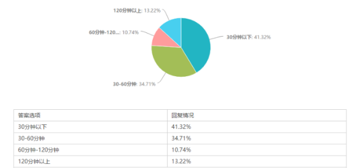
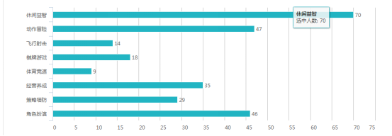
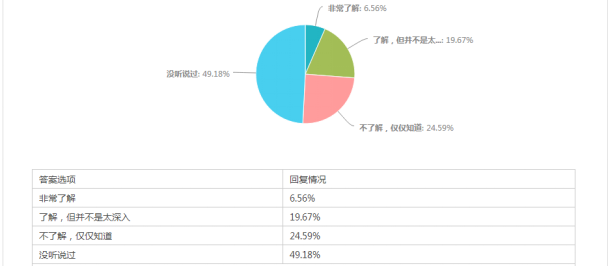

# 手机游戏市场调查报告

<!-- TOC depthFrom:2 -->

- [1. 调查背景](#1-调查背景)
- [2. 调查方案](#2-调查方案)
    - [2.1. 调查目的](#21-调查目的)
    - [2.2. 调查时间](#22-调查时间)
    - [2.3. 查范围及调查对象](#23-查范围及调查对象)
    - [2.4. 调查内容](#24-调查内容)
    - [2.5. 调查方法和方式](#25-调查方法和方式)
    - [2.6. 调查资料的整理和分析方法](#26-调查资料的整理和分析方法)
    - [2.7. 调查的进度和组织计划](#27-调查的进度和组织计划)
- [3. 数据分析](#3-数据分析)
- [4. 调查总结](#4-调查总结)

<!-- /TOC -->

## 1. 调查背景

随着3G、4G应用的快速推进以及智能手机的普及，手机正逐渐成为“个人信息处理中心”，覆盖到生活的方方面面，随着手机带宽的不断提速，互联网从PC过渡到手机的趋势正在加速蔓延，这也为手机游戏业的兴起造就了新的商业机遇。手机游戏正在呈现一个巨大的市场，成为移动互联网领域的热门增长点。

最早的手机游戏出现于1997年，经过十几年的发展，随着手机终端和移动通信网络的不断进步，手机游戏也正在经历由简单到复杂的进化过程。从全球来看，手机娱乐服务被公认为是带动移动数据业务快速发展的重要力量。作为手机娱乐服务的重要内容之一，近年来，伴随着移动网络和移动终端性能的不断提高与完善，手机游戏业务呈现快速增长的势头，成为一座名副其实的“金矿”。

伴随着智能手机的兴起，我国手机游戏产业近几年发展很快，手机游戏用户规模保持稳步增长趋势。2014年中国移动游戏市场规模达到276亿，同比增长率达86%。人口红利依然是促迚移动游戏市场高速发展的核心动力，未来随着用户增长放缓，中国移动游戏市场的增长率也将同步下降，但由于庞大的人口基数，每年的新用户数依然十分可观。截至2014年12月，手机游戏用户的规模为2.48亿，手机游戏用户成为国产游戏巨大增长动力，在市场和技术的推动下，我国手机游戏产业逐步走向成熟。

## 2. 调查方案

### 2.1. 调查目的

1. 调查玩手机游群体的年龄分布
1. 调查玩手机群体的职业分布
1. 调查人们玩手机游戏的频率
1. 调查人们每天玩手机游戏的时间
1. 调查人们对《东方project》的了解程度

### 2.2. 调查时间

2017.3.15-2017.3.22

总时间为一周

### 2.3. 查范围及调查对象

1. 郑州大学部分在校生
1. 部分社会人群
1. 常驻相关论坛、百度贴吧的二次元人士

### 2.4. 调查内容

| | |
| --- | --- |
| 答题人的基本情况	| 1.性别 2.年龄 3.职业 |
| 答题人玩手机游戏的情况 | 1.玩手机游戏的使用频率 2.每天玩手机游戏的时间 |
| 答题人喜欢的手游类型 | 供选择的类别有休闲益智，经营养成，棋牌游戏，体育竞速，策略塔防，角色 扮演等市面常见游戏类型 |
| 答题人对东方poject的了解程度 | 非常了解或者不了解等 |

### 2.5. 调查方法和方式

针对调查对象和调查内容的准确性，使用时间少、效率高的调查方法：问卷调查。根据目前人群对手机游戏的使用情况，参考网上相关论文，同时结合在校大学生手机游戏使用情况，制作出问卷，设计科学合理的问卷调查来做统计分析人们对手机游戏使用情况。

1. 以问卷调查为主，具体实施如下：在网上利用问卷星完成问卷的设计和制作后，将链接贴给小组各个成员，然后经由小组各个成员进行转发，并将问卷发布到各大论坛，百度贴吧以及知乎等大型平台，由此问卷便大面积的发布开来。
1. 以查阅文献为辅助，具体实施如下：查阅近年来各大门户网站的关于手机游戏市场的新闻，查阅相关论文与报道。

### 2.6. 调查资料的整理和分析方法

1. 网上收集的问卷，由答题人提交以后，问卷星系统自动收集并分析，不需要人工收集与分析，只需要管理问卷的人后台观察即可。
1. 调查结束后，问卷管理员将网上的问卷分析出的数据进行整合，并制作相关图表。

### 2.7. 调查的进度和组织计划

2017年3月15号之前制作出问卷，215.3.15-2015.3.22经由小组各个成员转发。

## 3. 数据分析

有效答题人数为120人。

上表可以得出答题人绝大部分处于17-26岁，有93.39%，只有极少数处于其他年龄段。这说明在常见网络社区的用户中，经常游玩手机游戏的群体基本为处于17-26岁的青年，这个结果是合理的并且符合我们预期。因为该群体接受新鲜事物比较快而且学习能力比较强，并且这类人的观念中一般都有享受生活，娱乐生活的观点，所以他们对游戏也比较感兴趣。

由上表可以得出手游用户的群体基本为在校人员和上班族，其中在校学生或者老师占比68.38%，占绝大多数，上班族占比21.37%，两者共占比几乎为全部，只有特别少的部分是个人经营者和无业者。

该表是对人们玩手机游戏频率的调查，8.26%的人选择从来不玩；48.76%占接近一半的人选择了偶尔玩一下；37.19%对的人群经常玩；5.79%的人沉迷手游。将近十分之九的人都接触手游，这说明手游已经跟人们的生活密不可分，绝大部分的人都会在无聊时玩一下，这也说明了，手游市场何其庞大。

这个表是答题人群每天玩手游的时间的调查，41.32%的人每天玩的 时间在30分钟以下，34.71%的在30-60分钟，10.74%的人在60-120分钟，13.32%的在120分钟以上。这说明大部分的被调查人都很喜欢玩手游，并且每天要花费30分钟以上的时间

上表是对人们所喜欢的游戏类型的调查，休闲益智位居第一，其次是动作冒险和角色扮演。

从上表可以了解到对《东方project》了解的人并不多只有25%，可以说是小众。市面上的东方游戏并不多，但是市场也是非常大的，25%也是一块大的蛋糕。

## 4. 调查总结

经过我们的调查和分析得到，手机游戏与人们的日常生活密不可分。学生党，上班族多在手游上消磨时间，所以手游市场非常广大，前景也很好。《东方project》虽然是小众，但是《东方project》系列自1997年发布以来，已经保持了几乎20年的生命活力，该系列作品早已经在亚洲的ACG文化圈内产生了巨大的影响力。这说明《东方project》有其自身独特的魅力，开发前景良好。
